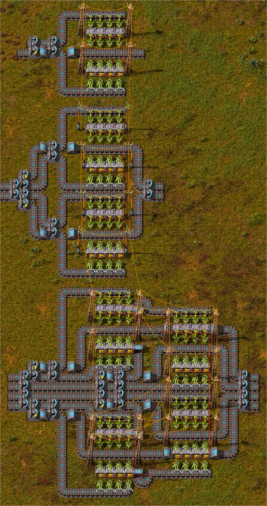

# Belt Buffer

1, 2 and 4 belt

ups optimised

## Features

- Train limit detection at loading station (set stack size in combinator and item type in station)
- Train required count at unloading station (set stack size and trains required in combinators)
- Load stations show green lights for full storage
- Unload stations show red lights for empty storage

## Screenshots

## Resources

- [factorioprints](https://factorioprints.com/view/-MoXuwU6P-uEi9ky2uU4)
