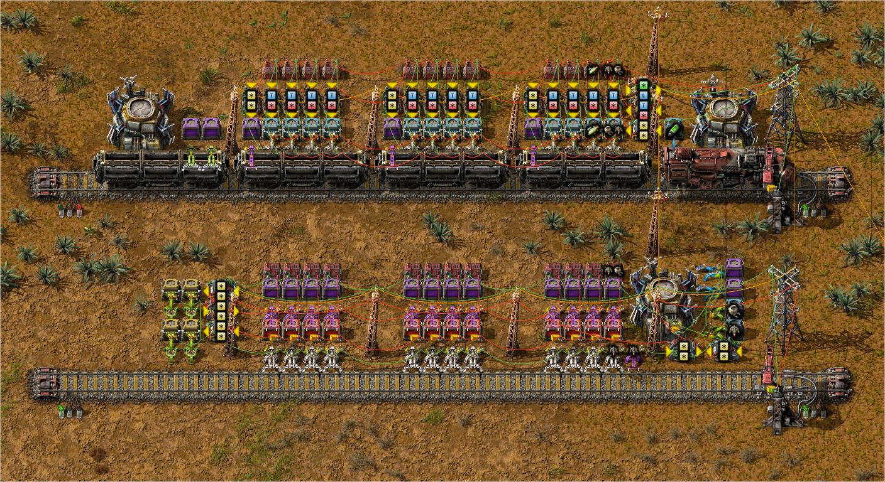

# Outpost Supply Station

## Deprecated

Moved to [supply-train](../supply-train/README.md).

## Usage

configure train contents at L station combinators

configure outpost requests at U station combinators

1.4 car, last car is junk return

roboport setup to add/remove bots as needed

## Features

- shows request on power pole (load and unload)
- only opens unload station if local stock is below half, or has junk in storage
- requester chests will operate even when train is not at station
- train won't leave loading until its full
- excess cargo removed at loading station
- returns unneeded items from outpost

## Screenshots

## Resources

- [factorioprints](https://factorioprints.com/view/-MoYFU9s2y_h_D_lQsiU)