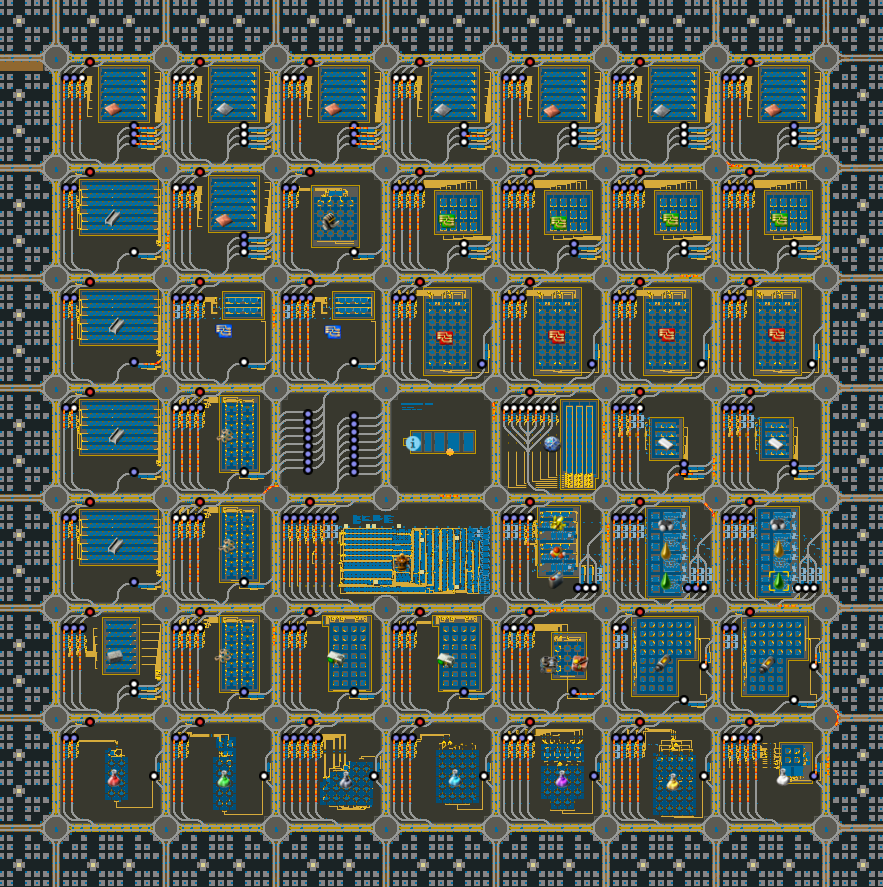
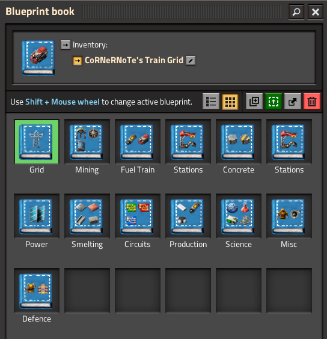

# Train Grid

## Screenshots

Sample 1kspm

## Usage

For ~1.2k SPM

- 5x copper plate
- 3x iron plate
- 4x steel plate
- 1x stone
- 1x engine
- 4x green cards
- 4x red cards
- 2x blue cards
- 2x plastic
- 2x refinery
- 1x acid batteries
- 3x low density structures
- 2x rocket control units
- 1x modules and furnaces
- 2x rocket fuel
- 1x each science (6 total)
- 1x research labs

## Resources

- [factorioprints](https://factorioprints.com/view/-MmkzLZMjC28qyeZRjS9)