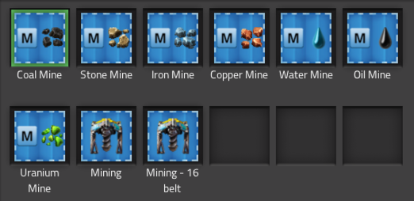
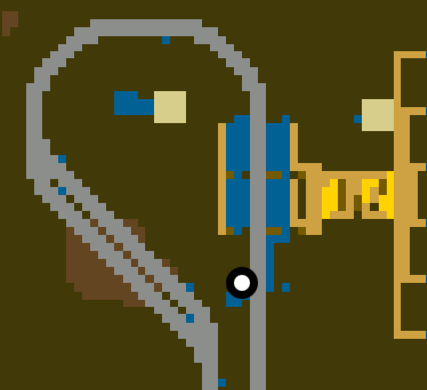

# Train Mines

Mines for 1-2 and 2-8 trains.

## Features

- Fast dual side loading
- Even loading using stack limit
- Load indicator
- Full roboports and radar coverage
- Extendable stacker
- Control Panel

## Control Panel Info

- 1-2 trains - bitshift 0
- 2-8 trains - bitshift 8

## Screenshots

