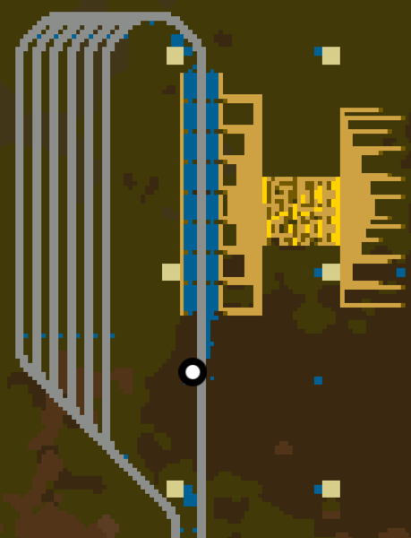

# Train Mines

Mines for 1-2 and 2-8 trains.

## Features

- Fast dual side loading
- Even loading using circuits
- Load indicator
- Full roboports and radar coverage
- Extendable stacker

## Todo

- read train contents (done, need to recopy bp)
- add control panel
- add game timer clock

## Screenshots

