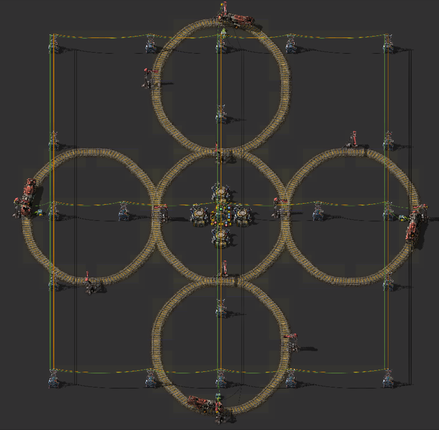

# Aesthetically Pleasing Wood Burner

## Technical Details

Implemented via 12 stations.

8 waypoint stations

4 wood fueling stations

300 wood is enough to run a train for 60000 ticks (16m40s)

There is a timer that counts up to 60000 and then resets.

To leave a bit of buffer, the fueling stations reenable after 50000 ticks (13m52s)

The trains go around the loop for the whole time the stations are disabled (50000 ticks), then park and refuel for the last 10000 ticks.

Trains are only allowed to leave the stations if each requester chest contains 300 wood (1200 total in the system). This prevents a case where all the wood has been burned up, which might result in the trains running out of fuel.

If they are out of wood, trains will remain at the stations until there is 1200 wood in the chests and the timer circuit is at <50000.

## Starting it up the first time

To start it up the first time, do the following:

Add a constant combinator making signal red = 1

Connect that combinator to the central substation with green wire.

Set each train to make its next stop the station it is parked at (via the "play" button next to that station in the train schedule GUI). That should put the trains in automatic, but they shouldn't be moving.

destroy (or turn off) the constant combinator you created previously

## Resources

- [source (reddit)](https://www.reddit.com/r/factorio/comments/i6cabr/aesthetically_pleasing_wood_burner/)

## Screenshots

